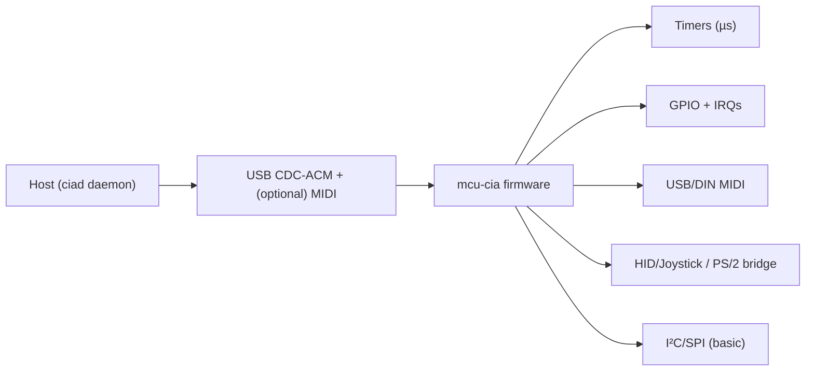

# mcu-cia

**Microcontroller I/O & timing module for CopperlineOS.**  
`mcu-cia` is firmware that brings back the spirit of the Amiga **CIA** (Complex Interface Adapter): precise timers, general‑purpose I/O, and low‑latency device bridges (MIDI, joysticks, GPIO, PS/2, etc.). It connects to a host over USB and exposes a tiny command protocol so CopperlineOS can schedule sub‑millisecond events and read inputs with minimal jitter.

> TL;DR: a tiny USB box that does accurate timers and fast I/O so the PC can stay busy rendering frames.

---

## Targets

- **RP2040** (Raspberry Pi Pico/Pico W and compatibles) — reference target.  
- **STM32** (F4/F7/H7) — community‑maintained.  
- **Build systems**: **TinyUSB + CMake** (RP2040), optional **PlatformIO** project files. Zephyr port is welcome.

License: **Apache‑2.0 OR MIT** for firmware and headers.

---

## What it does (Phase‑0)

- **Timers**: two 32‑bit microsecond timers with **periodic** or **one‑shot** modes; interrupt jitter ≤ 10 µs (RP2040).  
- **GPIO**: fast digital read/write, edge interrupts, debounced inputs.  
- **MIDI**: class‑compliant USB‑MIDI in/out and DIN‑MIDI (via UART) bridge.  
- **Joysticks/Gamepads**: USB‑HID device adapter → unified reports (classic + modern).  
- **PS/2**: optional keyboard/mouse bridge to HID.  
- **I²C/SPI** (basic): passthrough transfers for simple sensors/peripherals.  
- **Clock**: 64‑bit **TIME_US** monotonic clock synced to host on connect.

Everything is controllable with a small **USB protocol** (CDC‑ACM framing) so a host daemon can expose this as a `cia:` port in CopperlineOS.

---

## Architecture



<details>
<summary>Text-only fallback</summary>

```
Host (ciad) <-> USB (CDC-ACM) <-> mcu-cia firmware -> { timers, gpio, midi, hid, i2c/spi }
```
</details>

---

## USB protocol (v0, simple & scriptable)

**Transport:** USB CDC‑ACM (appears as `/dev/ttyACM*`). Messages are **length‑prefixed** binary frames:

```
+---------+---------------------------+
| u16 len | payload (len bytes)       |
+---------+---------------------------+
```

**Payload format:** UTF‑8 JSON (≤ 1024 bytes). Newline is optional and ignored.

### Requests (host → device)

```json
{ "cmd":"ping" }
{ "cmd":"time_us" }                                // query 64-bit time
{ "cmd":"timer_set","id":0,"us":5000,"period":true }
{ "cmd":"timer_stop","id":0 }
{ "cmd":"gpio_write","pin":15,"value":1 }
{ "cmd":"gpio_read","pin":15 }
{ "cmd":"gpio_mode","pin":15,"mode":"in_pullup" }  // modes: in, in_pullup, out
{ "cmd":"midi_out","data":[144,60,100]}            // status+data bytes
{ "cmd":"i2c_xfer","addr":80,"tx":[1,2],"rx":4 }   // read 4 bytes after writing 0x01,0x02
{ "cmd":"set_rtc","time_us":1234567890 }           // host→device clock sync
```

### Responses (device → host)

```json
{ "ok":true,  "result":{...} }
{ "ok":false, "error":"BAD_ARG" }
```

### Events (async device → host)

```json
{ "event":"timer","id":0,"time_us":12345678 }
{ "event":"gpio","pin":15,"edge":"rising","time_us":123 }
{ "event":"midi","data":[144,60,0] }
{ "event":"hid","type":"gamepad","axes":[0,0],"buttons":3,"time_us":456 }
```

> The host daemon **ciad** (separate repo: planned) bridges this USB link to a Copperline **port** at `/run/copperline/ciad.sock`, so scripts/apps can subscribe to events and schedule timers using the same message style as other services.

---

## Pin mapping (RP2040 default)

| Function | Pin(s) | Notes |
|---|---|---|
| UART0 (DIN‑MIDI) | GP0 (TX), GP1 (RX) | 31250 baud |
| I²C0 | GP4 (SDA), GP5 (SCL) | 100/400 kHz |
| SPI0 | GP16 (MOSI), GP18 (SCLK), GP19 (MISO) | optional |
| PS/2 (kbd) | GP2 (DATA), GP3 (CLK) | optional |
| User LED | GP25 | active high |

Adjust in `boards/pico/config.h` or via CMake options.

---

## Building (RP2040 / TinyUSB)

### Prereqs

- **CMake** ≥ 3.13  
- **ARM GCC** (e.g., `gcc-arm-none-eabi`)  
- **Pico SDK** + **TinyUSB** (submodules)

### Steps

```bash
git clone https://github.com/CopperlineOS/mcu-cia
cd mcu-cia
git submodule update --init --recursive  # pulls pico-sdk and tinyusb

mkdir build && cd build
cmake -DPICO_SDK_PATH=../third_party/pico-sdk -DCMAKE_BUILD_TYPE=Release ..
cmake --build . -j
```

Artifacts: `mcu_cia.uf2` (drag‑and‑drop onto `RPI-RP2`), and `mcu_cia.elf`.

### Flash

- **UF2**: hold BOOTSEL, plug USB, copy `mcu_cia.uf2` to the mass‑storage device.  
- **SWD** (optional): use Picoprobe/Black Magic; see `docs/flash.md`.

---

## Host integration

Until `ciad` lands, you can poke the device manually:

```bash
# Linux serial settings (115200 8N1; length-prefixed frames)
stty -F /dev/ttyACM0 115200 raw -echo -icrnl -ocrnl

# Send a 'ping' (len + JSON)
python3 - <<'PY'
import sys,struct,os
dev="/dev/ttyACM0"
msg=b'{"cmd":"ping"}'
frame=struct.pack("<H",len(msg))+msg
with open(dev,"wb",buffering=0) as f: f.write(frame)
with open(dev,"rb",buffering=0) as f: print(f.read(4+len(msg)))
PY
```

When the **ciad** daemon is running, you’ll use the normal Copperline **port**:

```bash
portctl /run/copperline/ciad.sock '{"cmd":"timer_set","id":0,"us":16666,"period":true}'
portctl /run/copperline/ciad.sock '{"cmd":"subscribe","events":["timer","midi","gpio"]}' --stream
```

---

## Timing notes

- The device maintains a 64‑bit **monotonic microsecond** counter.  
- On connect and periodically, the host can `set_rtc` to clamp drift (slew, never step during active timers).  
- RP2040 reference jitter targets: **≤10 µs** timer callback jitter; **≤50 µs** USB read latency under light host load.

---

## Roadmap

- **v0.1**: RP2040 firmware (timers, GPIO, MIDI, HID gamepad), CDC JSON protocol.  
- **v0.2**: STM32 port; SPI/I²C quality improvements; PS/2 stable.  
- **v0.3**: Bulk endpoint + CBOR framing; DMA for UART/I²C; timestamping on USB SOF.  
- **v0.4**: Genlock/clock‑sync modes (SOF‑locked), calibration tool.  
- **v0.5**: ciad daemon: Copperline port, capability tokens, multiple devices.

Specs will live in [`CopperlineOS/docs`](https://github.com/CopperlineOS/docs).

---

## Contributing

- Keep firmware modules small; avoid blocking waits; use IRQs/DMA.  
- Add unit tests for protocol handlers and basic HW‑in‑the‑loop tests where possible.  
- Validate all inputs from USB; clamp lengths and indices.  
- Prefer TinyUSB for USB layers; avoid vendor‑specific quirks unless guarded by `#ifdef BOARD_*`.

See `CONTRIBUTING.md` and `CODE_OF_CONDUCT.md`.

---

## License

Dual‑licensed under **Apache‑2.0 OR MIT**.

---

## See also

- [`fpga-copper`](https://github.com/CopperlineOS/fpga-copper) · [`fpga-blitter`](https://github.com/CopperlineOS/fpga-blitter)  
- Host services: [`copperd`](https://github.com/CopperlineOS/copperd) · [`compositord`](https://github.com/CopperlineOS/compositord) · [`blitterd`](https://github.com/CopperlineOS/blitterd) · [`audiomixerd`](https://github.com/CopperlineOS/audiomixerd)
